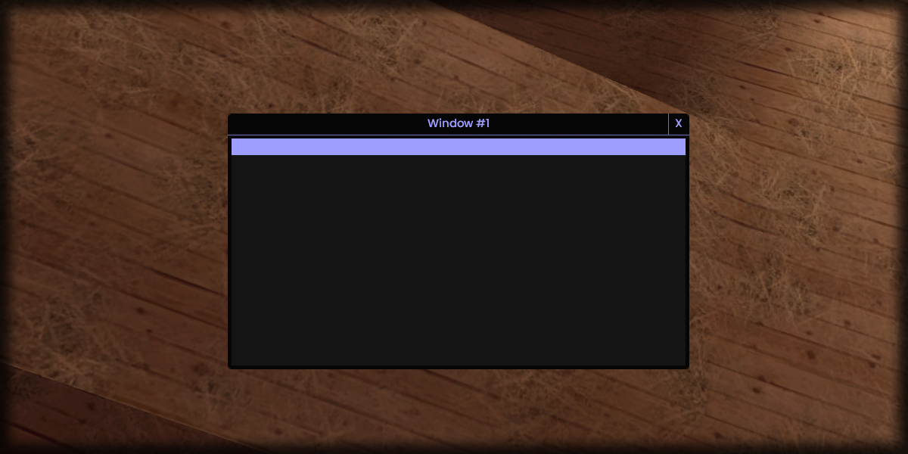

# createGridlist

## **Syntax:**

```lua
gridlist createGridlist(x, y, width, height, [parent = nil], [postGUI = false])
```

### **Parameters:**

* **x** \(float\) : Absolute x coordinate of the gridlist within the container.
* **y** \(float\) : Absolute y coordinate of the gridlist within the container.
* **width** \(float\) : Absolute width of the gridlist.
* **height** \(float\) : Absolute height of the gridlist.
* **parent** \(element\) : Supported parent element to use as a container for the gridlist. \(_Optional_\)
* **postGUI** \(bool\) : State whether the UI will be drawn below/over CEGUI. \(_Optional_\)

### **Returns:**

* **gridlist** \(element\) : Created gridlist element.

## **Example:**

```lua
local sX, sY = guiGetScreenSize()
local window_width, window_height = 600, 300
local createdWindow = beautify.window.createWindow((sX - window_width)/2, (sY - window_height)/2, window_width, window_height, "Window #1", nil, false)
local createdGridlist = beautify.gridlist.createGridlist(0, 0, window_width, window_height, createdWindow, false)
beautify.setUIDraggable(createdWindow, true)
beautify.setUIVisible(createdWindow, true)
beautify.setUIVisible(createdGridlist, true)
```



