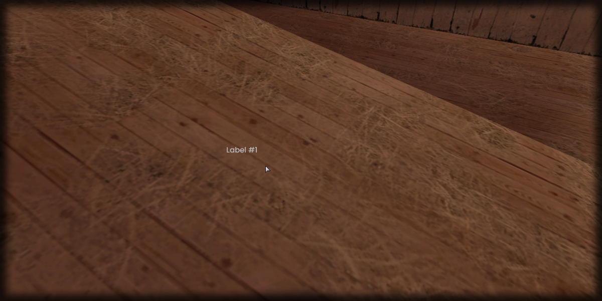

# create

## **Syntax:**

```lua
label create(text, x, y, width, height, [parent = nil], [postGUI = false])
```

### **Parameters:**

* **text** \(string\) : Text of the label.
* **x** \(float\) : Absolute x coordinate of the label within the container.
* **y** \(float\) : Absolute y coordinate of the label within the container.
* **width** \(float\) : Absolute width of the label.
* **height** \(float\) : Absolute height of the label.
* **parent** \(element\) : Supported parent element to use as a container for the label. \(_Optional_\)
* **postGUI** \(bool\) : State whether the UI will be drawn below/over CEGUI. \(_Optional_\)

### **Returns:**

* **label** \(element\) : Created label element.

## **Example:**

```lua
local sX, sY = guiGetScreenSize()
local label_width, label_height = 300, 50
local createdLabel = beautify.label.create("Label #1", (sX - label_width)/2, (sY - label_height)/2, label_width, label_height, nil, false)
beautify.setUIDisabled(createdLabel, true)
beautify.setUIVisible(createdLabel, true)
```



