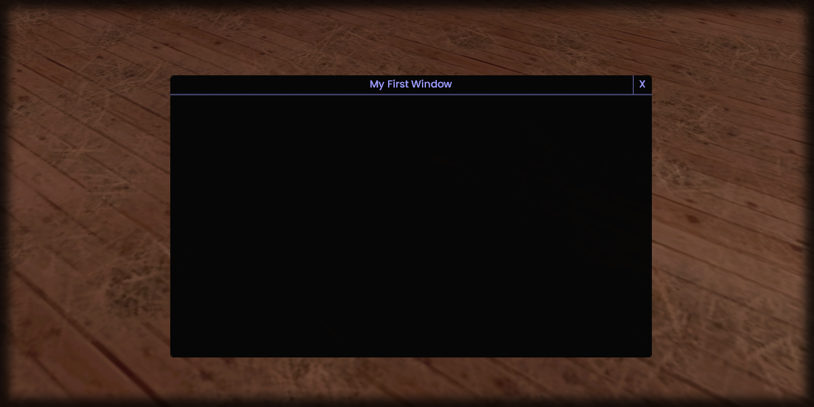
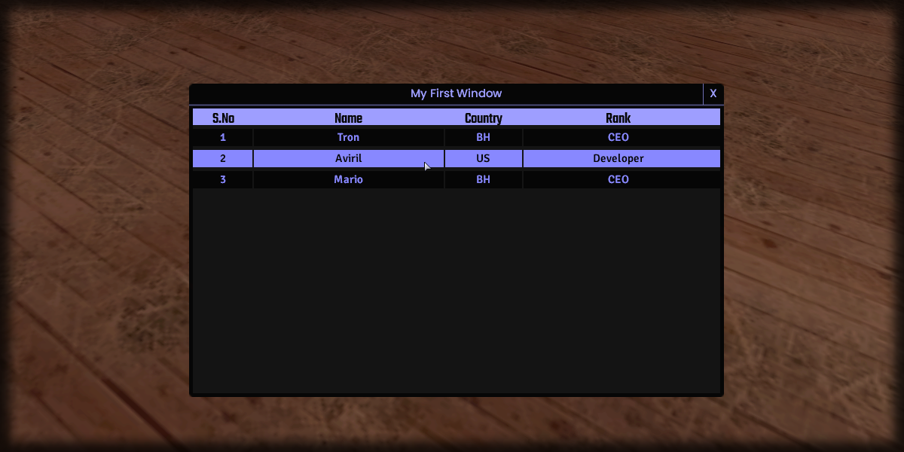

# Getting Started

## ━ How to get started?

* You need to know how to use Lua & Debug scripts.
* Presuming you have installed the library, this page guides you on how to get started with the framework!
* Download & Install your preferred code IDE [VS Code \(Recommended\)](https://code.visualstudio.com/download).
* Initialize **Beautify's** module within the script you want to use it.

## ━ How to Initialize the Module?

**Add the below codes once in either of the `.lua` script of the resource you want to use it:**

```lua
-- Declare it globally once
beautify = exports.beautify_library:fetchImports()
loadstring(beautify)()
```

## ━ How to Invoke the APIs?

**Since you have initialized and imported** Beautify's **module, you can invoke APIs now as below:**

```lua
-- Creates a centered window & sets it draggable 
local sX, sY = guiGetScreenSize()
local window_width, window_height = 700, 378
local createdWindow = beautify.window.createWindow((sX - window_width)/2, (sY - window_height)/2, window_width, window_height, "My First Window", nil, false)
beautify.setUIDraggable(createdWindow, true)
beautify.setUIVisible(createdWindow, true)
```



```lua
-- Creates a gridlist with some columns and adds it within the window created above
local createdGridlist = beautify.gridlist.createGridlist(0, 0, window_width, window_height, createdWindow, false)
beautify.gridlist.addGridlistColumn(createdGridlist, "S.No", 75)
beautify.gridlist.addGridlistColumn(createdGridlist, "Name", 250)
beautify.gridlist.addGridlistColumn(createdGridlist, "Country", 100)
beautify.gridlist.addGridlistColumn(createdGridlist, "Rank", 250)
beautify.setUIVisible(createdGridlist, true)
```


```lua
-- Appends some rows from predefined table into the gridlist created above
local dummyRowDatas = {
    {
        [2] = "Tron", [3] = "BH", [4] = "CEO"
    },
    {
        [2] = "Aviril", [3] = "US", [4] = "Developer"
    },
    {
        [2] = "Mario", [3] = "BH", [4] = "CEO"
    }
}

for i, j in ipairs(dummyRowDatas) do
    local rowIndex = beautify.gridlist.addGridlistRow(createdGridlist)
    beautify.gridlist.setGridlistRowData(createdGridlist, rowIndex, 1, tostring(beautify.gridlist.countGridlistRows(createdGridlist)))
    for k, v in pairs(j) do
        beautify.gridlist.setGridlistRowData(createdGridlist, rowIndex, k, tostring(v))
    end
end
```



## ━ How to get the API Names?

**Head over to the sidebar and navigate into the section 'E L E M E N T S'. Dive into the element you wish to learn further more about \(Properties/APIs etc\).**

